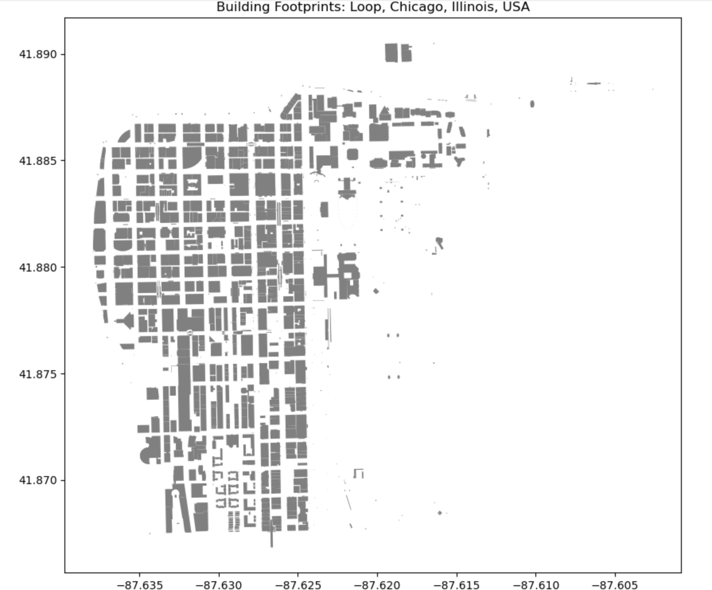
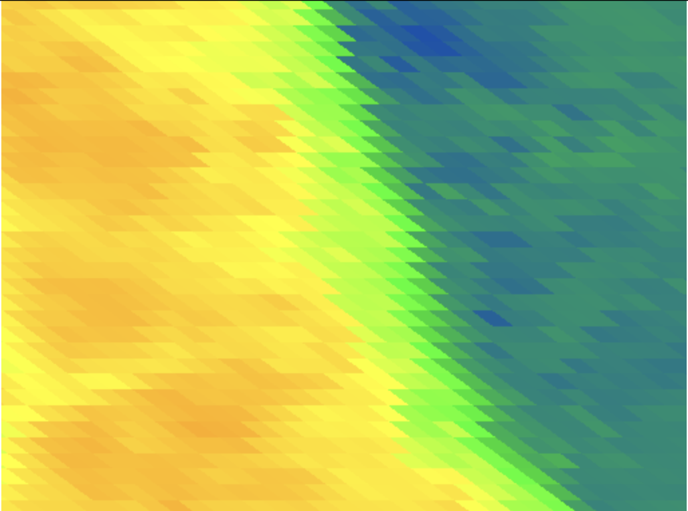
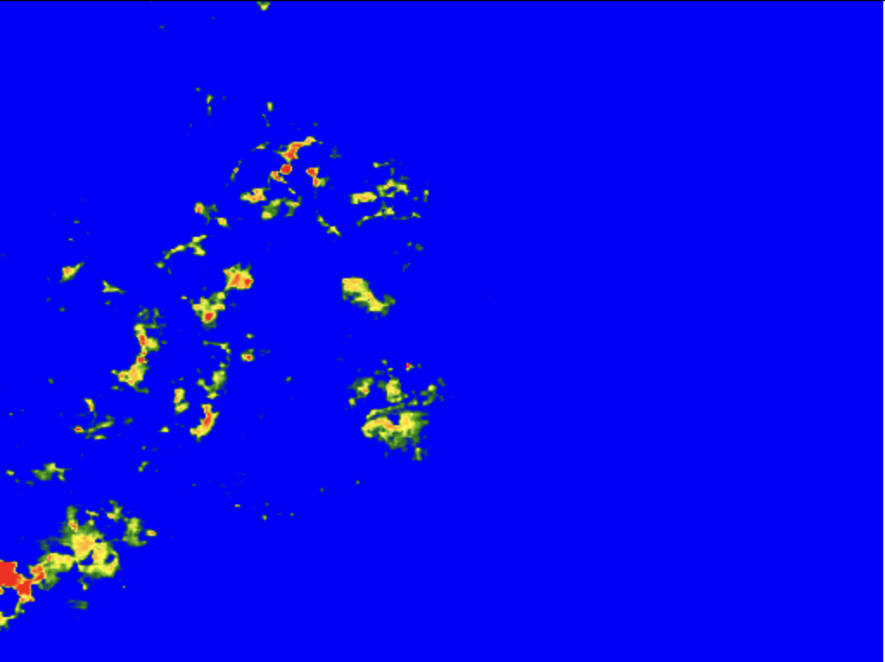

# AeroTherm AI: Multi Model Geospatial Intelligence for Hyper Local Heat Risk Prediction
Geospatial AI analysis using Landsat 9 thermal data and OSMnx to study Urban Heat Island effects and shading in the Chicago Loop.
AeroTherm AI: Chicago Urban Heat Analysis 📊🏙️

## 📝 Executive Summary:

This Data Analytics project investigates the thermal relationship between urban density and surface temperatures in Chicago. By analyzing 1,238 building footprints alongside Landsat 9 satellite imagery, I performed a comparative analysis to determine how infrastructure impacts local climates.

## 🛠️ Analyst Tech Stack:

Data Extraction: OSMnx (OpenStreetMap API)

Data Processing: Python (Pandas, GeoPandas)

Remote Sensing Data: Google Earth Engine API

Data Visualization: Matplotlib (Spatial Mapping)

### Building Footprints

## 📈 Data Pipeline & Methodology:

Requirement Gathering: Defined "Urban Heat Island" metrics for the Chicago Loop.

Data Acquisition: Extracted vector geometry for 1,238 buildings and raster thermal data from Landsat 9.

Data Cleaning: Filtered satellite collections for specific summer date ranges to ensure data quality.

Comparative Analysis: Calculated mean surface temperatures for a high-density "Urban Core" vs. a "Green Space" control site.

### Urban Density

## 💡 Analytical Insights: 

The analysis revealed that the Loop (Urban Core) was slightly cooler than Lincoln Park during the observation period. As an analyst, I identified three key variables contributing to this result:

The Shading Variable: 1,238 buildings act as structural shading, reducing direct ground-level solar radiation.

Geographic Mitigation: Proximity to Lake Michigan creates a "Lake Breeze" effect, serving as a natural temperature regulator for the downtown area.

Material Properties: Identified a "Thermal Lag" where dense building materials heat up at a slower rate than vegetated park surfaces.

### Thermal Heat Map

## ✅ Key Deliverables

Building Density Map: Visualizing 1,238 structural footprints in the Loop.
Thermal Comparative Report: Statistical summary of temperature variances between urban and green zones.

## ✅ Why This Project Matters
Urban Heat Islands impact public health, energy consumption, and climate resilience.
This project demonstrates how geospatial analytics and remote sensing can inform urban planning, sustainability, and data-driven policy decisions.

